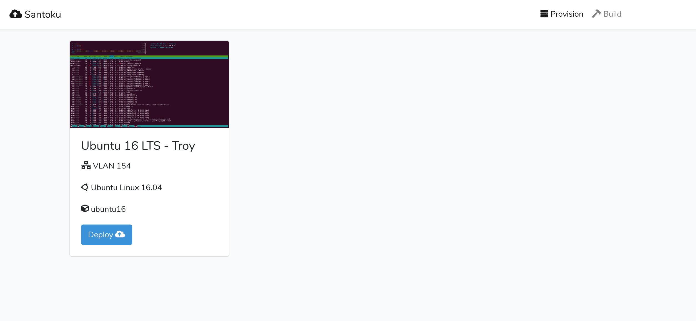
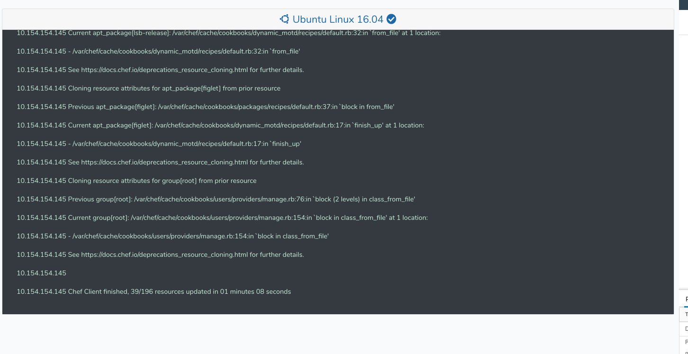

# Santoku
Santoku is a web app that wraps around `knife vsphere` written in Laravel VueJS and Node. 
It allows you to deploy and bootstrap vmWare virtual machines with the click of a button.

---

##### Heads up
It's a weekend project that is lacking some basic features like authentication. That being said it does what it's supposed to and can easily be expanded upon.

## Install Directions
Stay tuned...

## Screenshots

